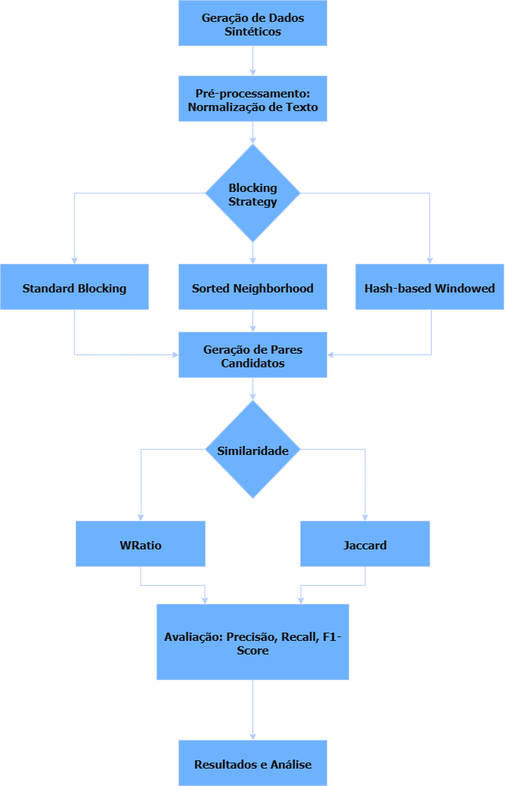

---

# 🔎 Deduplicação Distribuída de Registros com Apache Spark

Este repositório apresenta uma abordagem distribuída para **deduplicação de registros em larga escala**, implementada com **Apache Spark**.
O projeto foi desenvolvido como parte de uma pesquisa acadêmica sobre técnicas de *Entity Resolution (ER)* aplicadas em cenários de **Big Data**.

---

## 📌 Motivação

A duplicidade de registros compromete a qualidade de dados em bases massivas, impactando diretamente análises, tomada de decisão e eficiência operacional.
Tradicionalmente, métodos de deduplicação exigem comparações exaustivas (*O(n²)*), inviáveis para milhões de registros.

Neste trabalho, avaliamos estratégias de **blocking** e **similaridade** para equilibrar **qualidade** (F1-Score) e **eficiência computacional** (tempo de execução e throughput).

---

## ⚙️ Pipeline Proposto



1. **Geração de Dados Sintéticos**
2. **Pré-processamento** (normalização de texto)
3. **Blocking Strategy**

   * Standard Blocking
   * Sorted Neighborhood
   * Hash-based Windowed
4. **Geração de Pares Candidatos**
5. **Cálculo de Similaridade**

   * WRatio (baseado em Levenshtein)
   * Jaccard (token-based)
6. **Avaliação**

   * Precisão
   * Recall
   * F1-Score
7. **Resultados e Análise**

---

## 🛠️ Tecnologias Utilizadas

* **Apache Spark 3.5.1**
* **Python 3.10+**
* **PySpark** (processamento distribuído)
* **RapidFuzz** (similaridade de strings)
* **Pandas / Matplotlib / Seaborn** (análise e visualização)
* **Faker** (geração de dados sintéticos)
* Ambiente: **Google Colab**

---

## 📊 Conjuntos de Dados

Foram gerados datasets sintéticos com **20% de duplicatas**, em três escalas:

* **10 mil registros**
* **100 mil registros**
* **1 milhão de registros**

---

## 🚀 Execução

### Pré-requisitos

* Python 3.10+
* Apache Spark 3.5.1
* Instalar dependências:

```bash
pip install pyspark pandas rapidfuzz matplotlib seaborn faker
```

### Rodando no Google Colab

1. Clone este repositório:

```bash
git clone https://github.com/SEU_USUARIO/deduplicacao-spark.git
```

2. Abra o notebook:

```bash
10k,100k,1m.ipynb
```

3. Execute as células para reproduzir os experimentos.

---

## 📈 Resultados Principais

* **Standard Blocking + WRatio** obteve o **maior F1-score (0,725)** em 10k registros.
* Entretanto, essa estratégia apresentou queda brusca em bases maiores (**F1 = 0,035 em 1M**).
* **Hash-based Windowed Blocking** foi a **mais escalável**, processando 1M registros com melhor eficiência temporal e uso de memória.
* Foi observada a compensação (*trade-off*) entre **qualidade** e **eficiência**:

  * **Standard Blocking** → Alta qualidade, baixa escalabilidade.
  * **Hash-based Windowed** → Maior eficiência, menor qualidade.

---

## 📚 Referências

* Christen, P. *Data Matching: Concepts and Techniques for Record Linkage, Entity Resolution, and Duplicate Detection*. Springer, 2012.
* Zaharia, M. et al. *Apache Spark: The Definitive Guide*. O’Reilly Media, 2018.
* Kolb, L.; Thor, A.; Rahm, E. *Dedoop: Efficient Deduplication with Hadoop*. VLDB Endowment, 2012.

---

## ✨ Autores

* Genário C. Azevedo
* Matheus Henrique A. Gomes
* Romário A. França

---
